# CSS Standard

Gurted implements a **utility-first CSS approach** similar to Tailwind CSS, but rendered natively through Flumi. This allows for rapid styling without writing custom CSS rules while maintaining native performance.

## CSS Integration

CSS can be included in Gurted documents through multiple methods:

```html
<head>
    <!-- Inline styles in head -->
    <style>
        h1 { text-[#ff0000] font-italic hover:text-[#00ff00] }
        p { text-[#333333] text-2xl }
        button { hover:bg-[#FF6B35] hover:text-[#FFFFFF] active:bg-[#CC5429] }
    </style>
    
    <!-- External stylesheet -->
    <style src="styles.css">
</head>

<body>
    <!-- Inline styles on elements -->
    <div style="flex flex-col gap-4 p-4 bg-[#f8fafc] rounded">
        <h1 style="text-3xl font-bold text-center">Styled Content</h1>
    </div>
</body>
```

## Typography

### Font Sizes
Gurted uses a progressive font scaling system where each size corresponds to specific pixel values:

```html
<p style="text-xs">Extra small text (18px) - Used for fine print, captions</p>
<p style="text-sm">Small text (21px) - Used for secondary information</p>
<p style="text-base">Base text (24px) - Default body text size</p>
<p style="text-lg">Large text (27px) - Slightly emphasized text</p>
<p style="text-xl">Extra large text (30px) - Small headings</p>
<p style="text-2xl">2XL text (36px) - Medium headings</p>
<p style="text-3xl">3XL text (45px) - Large headings</p>
<p style="text-4xl">4XL text (54px) - Very large headings</p>
<p style="text-5xl">5XL text (72px) - Display headings</p>
<p style="text-6xl">6XL text (90px) - Hero headings</p>
```

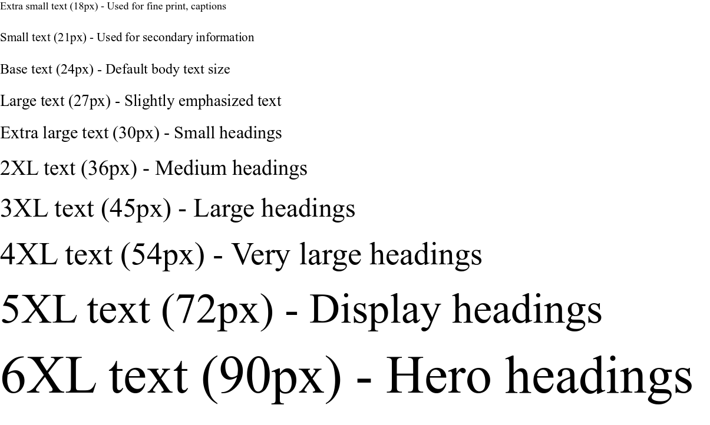

:::note
Flumi, being made in Godot, handles pixel sizes different. `24px` in font size is the equivalent of `16px` in standard browsers.
:::

**How to choose font sizes:**
- `text-xs` to `text-sm`: Secondary content, labels, captions
- `text-base` to `text-lg`: Body text and paragraphs
- `text-xl` to `text-2xl`: Subheadings
- `text-3xl` to `text-6xl`: Main headings and titles

:::info
Utilities have been set to mimic real browser font sizes, which is why `text-6xl` will likely look similar in Flumi and Tailwind.
:::

### Font Families
Font families control the typeface used for text. Each has different characteristics:

```html
<p style="font-sans">Sans-serif font (default) - Clean, modern appearance without decorative strokes</p>
<p style="font-serif">Serif font - Traditional typeface with decorative strokes, good for formal documents</p>
<p style="font-mono">Monospace font - Each character takes the same width, ideal for code</p>
<p style="font-roboto">Custom web font (requires <font> declaration) - External font loaded from web</p>
```

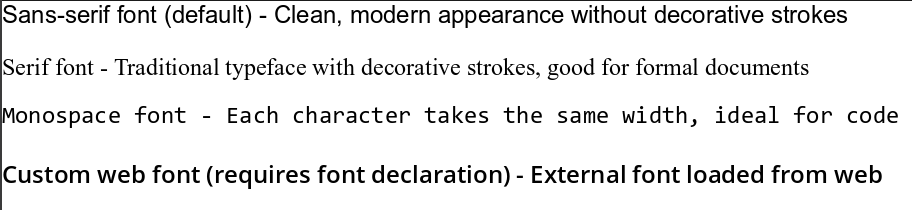

:::info
Flumi uses the **system fonts** for its built-in font families. This means the appearance of fonts such as `monospace`, `serif`, and `sans-serif` will match how they are rendered by your operating system, similar to standard web browsers.
:::

**Font characteristics:**
- **Sans-serif**: Clean, readable on screens, modern feel
- **Serif**: Traditional, formal, good for printed text
- **Monospace**: Fixed-width characters, perfect for code and data tables

Custom fonts must be declared in the document head before use:

```html
<head>
    <font name="roboto" src="https://fonts.gstatic.com/.../roboto.woff2" />
    <style>
        body { font-roboto }
    </style>
</head>
```
The `name` attribute is used to reference the font in styles. The `weight` attribute can be used to specify the font weight.
```html
<font name="roboto" src="https://fonts.gstatic.com/.../roboto.woff2" weight="400" />
```

### Font Styling
Text decoration and weight control visual emphasis:

```html
<p style="font-bold">Bold text - Makes text thicker and more prominent</p>
<p style="font-italic">Italic text - Slants text for emphasis or citations</p>
<p style="underline">Underlined text - Adds line below text, commonly used for links</p>
<p style="font-bold font-italic underline">Combined styles - Multiple decorations applied together</p>
```
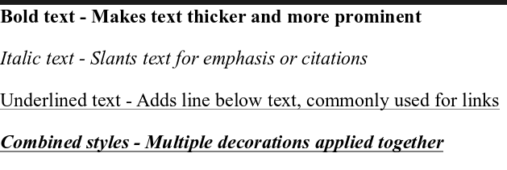

### Text Alignment
Controls how text is positioned within its container:

```html
<p style="text-left">Left aligned text - Text starts from the left edge (default)</p>
<p style="text-center">Center aligned text - Text is centered horizontally</p>
<p style="text-right">Right aligned text - Text aligns to the right edge</p>
<p style="text-justify">Justified text - Text spreads across full width with even spacing</p>
```
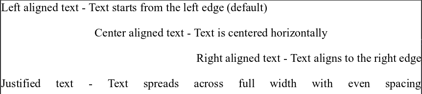

## Colors

### Understanding Color Systems
Gurted supports two color systems: **hex and RGB values** for precise colors and **predefined colors** for consistency.

**Hex Colors** use # followed by 6 characters (0-9, A-F) representing Red, Green, Blue values:
- `#ff0000` = Pure red (ff=255 red, 00=0 green, 00=0 blue)
- `#00ff00` = Pure green
- `#0000ff` = Pure blue
- `#ffffff` = White (maximum all colors)
- `#000000` = Black (no color)

**RGB Colors** use `rgb(r, g, b)` format where `r`, `g`, `b` are values from `0` to `255`:
```html
<p style="text(rgb(255, 0, 0))">Red text - Using RGB format</p>
<p style="text(rgb(0, 255, 0))">Green text - Using RGB format</p>
<p style="text(rgb(0, 0, 255))">Blue text - Using RGB format</p>
```
`rgba(r, g, b, a)` is also supported, where `a` is the alpha channel for transparency (0-1 range)

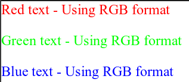

### Text Colors
Control the color of text content:

```html
<!-- Custom hex colors - Use brackets for exact color values -->
<p style="text-[#ff0000]">Red text - Bright red using hex value</p>
<p style="text-[#3b82f6]">Blue text - Modern blue shade</p>
<p style="text-[#10b981]">Green text - Professional green tone</p>

<!-- Predefined color palette - Color name + intensity number -->
<p style="text-red-500">Red 500 - Medium intensity red from palette</p>
<p style="text-blue-600">Blue 600 - Slightly darker blue</p>
<p style="text-green-400">Green 400 - Lighter green tone</p>
<p style="text-gray-700">Gray 700 - Dark gray for readable text</p>
<p style="text-slate-800">Slate 800 - Very dark blue-gray</p>
```
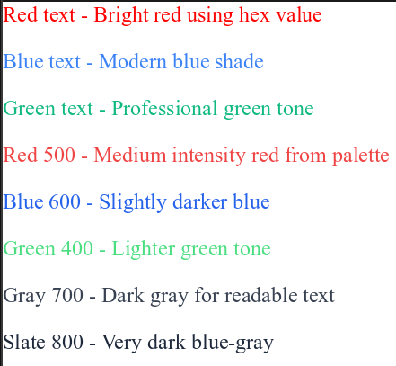

### Background Colors
Same color system applies to element backgrounds:

```html
<!-- Custom hex backgrounds -->
<div style="bg-[#f8fafc] p-4">Light gray background - Almost white with slight blue tint</div>
<div style="bg-[#1e293b] text-white p-4">Dark background - Dark blue-gray, needs white text</div>

<!-- Predefined backgrounds -->
<div style="bg-red-100 p-4">Light red background - Very light red tint</div>
<div style="bg-blue-500 text-white p-4">Blue background - Medium blue, needs white text for contrast</div>
<div style="bg-green-600 text-white p-4">Green background - Darker green, needs white text</div>
```
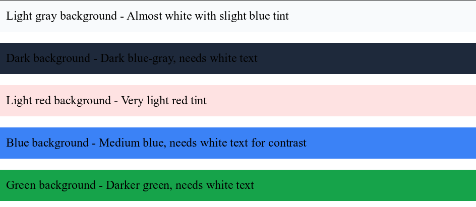

### Available Colors
Colors are formed by their name and their shade, example: `text-red-500` or `bg-blue-300`.

**Color shade scale (50-950):**
- **50-200**: Very light tints, good for backgrounds
- **300-400**: Light colors, good for subtle accents
- **500-600**: Medium colors, good for primary elements
- **700-800**: Dark colors, good for text and emphasis
- **900-950**: Very dark colors, good for strong contrast

These are directly taken from [Tailwind CSS](https://tailwindcss.com/docs/customizing-colors#default-color-palette).
<table>
  <thead>
    <tr>
      <th>Color</th>
      <th>50</th><th>100</th><th>200</th><th>300</th><th>400</th>
      <th>500</th><th>600</th><th>700</th><th>800</th><th>900</th><th>950</th>
    </tr>
  </thead>
  <tbody>
    <tr>
      <td>Red</td>
      <td><span className="color-box" style={{ background: '#fef2f2' }} /></td>
      <td><span className="color-box" style={{ background: '#fee2e2' }} /></td>
      <td><span className="color-box" style={{ background: '#fecaca' }} /></td>
      <td><span className="color-box" style={{ background: '#fca5a5' }} /></td>
      <td><span className="color-box" style={{ background: '#f87171' }} /></td>
      <td><span className="color-box" style={{ background: '#ef4444' }} /></td>
      <td><span className="color-box" style={{ background: '#dc2626' }} /></td>
      <td><span className="color-box" style={{ background: '#b91c1c' }} /></td>
      <td><span className="color-box" style={{ background: '#991b1b' }} /></td>
      <td><span className="color-box" style={{ background: '#7f1d1d' }} /></td>
      <td><span className="color-box" style={{ background: '#450a0a' }} /></td>
    </tr>
    <tr>
      <td>Orange</td>
      <td><span className="color-box" style={{ background: '#fff7ed' }} /></td>
      <td><span className="color-box" style={{ background: '#ffedd5' }} /></td>
      <td><span className="color-box" style={{ background: '#fed7aa' }} /></td>
      <td><span className="color-box" style={{ background: '#fdba74' }} /></td>
      <td><span className="color-box" style={{ background: '#fb923c' }} /></td>
      <td><span className="color-box" style={{ background: '#f97316' }} /></td>
      <td><span className="color-box" style={{ background: '#ea580c' }} /></td>
      <td><span className="color-box" style={{ background: '#c2410c' }} /></td>
      <td><span className="color-box" style={{ background: '#9a3412' }} /></td>
      <td><span className="color-box" style={{ background: '#7c2d12' }} /></td>
      <td><span className="color-box" style={{ background: '#431407' }} /></td>
    </tr>
    <tr>
      <td>Amber</td>
      <td><span className="color-box" style={{ background: '#fffbeb' }} /></td>
      <td><span className="color-box" style={{ background: '#fef3c7' }} /></td>
      <td><span className="color-box" style={{ background: '#fde68a' }} /></td>
      <td><span className="color-box" style={{ background: '#fcd34d' }} /></td>
      <td><span className="color-box" style={{ background: '#fbbf24' }} /></td>
      <td><span className="color-box" style={{ background: '#f59e0b' }} /></td>
      <td><span className="color-box" style={{ background: '#d97706' }} /></td>
      <td><span className="color-box" style={{ background: '#b45309' }} /></td>
      <td><span className="color-box" style={{ background: '#92400e' }} /></td>
      <td><span className="color-box" style={{ background: '#78350f' }} /></td>
      <td><span className="color-box" style={{ background: '#451a03' }} /></td>
    </tr>
    <tr>
      <td>Yellow</td>
      <td><span className="color-box" style={{ background: '#fefce8' }} /></td>
      <td><span className="color-box" style={{ background: '#fef9c3' }} /></td>
      <td><span className="color-box" style={{ background: '#fef08a' }} /></td>
      <td><span className="color-box" style={{ background: '#fde047' }} /></td>
      <td><span className="color-box" style={{ background: '#facc15' }} /></td>
      <td><span className="color-box" style={{ background: '#eab308' }} /></td>
      <td><span className="color-box" style={{ background: '#ca8a04' }} /></td>
      <td><span className="color-box" style={{ background: '#a16207' }} /></td>
      <td><span className="color-box" style={{ background: '#854d0e' }} /></td>
      <td><span className="color-box" style={{ background: '#713f12' }} /></td>
      <td><span className="color-box" style={{ background: '#422006' }} /></td>
    </tr>
    <tr>
      <td>Lime</td>
      <td><span className="color-box" style={{ background: '#f7fee7' }} /></td>
      <td><span className="color-box" style={{ background: '#ecfccb' }} /></td>
      <td><span className="color-box" style={{ background: '#d9f99d' }} /></td>
      <td><span className="color-box" style={{ background: '#bef264' }} /></td>
      <td><span className="color-box" style={{ background: '#a3e635' }} /></td>
      <td><span className="color-box" style={{ background: '#84cc16' }} /></td>
      <td><span className="color-box" style={{ background: '#65a30d' }} /></td>
      <td><span className="color-box" style={{ background: '#4d7c0f' }} /></td>
      <td><span className="color-box" style={{ background: '#3f6212' }} /></td>
      <td><span className="color-box" style={{ background: '#365314' }} /></td>
      <td><span className="color-box" style={{ background: '#1a2e05' }} /></td>
    </tr>
    <tr>
      <td>Green</td>
      <td><span className="color-box" style={{ background: '#f0fdf4' }} /></td>
      <td><span className="color-box" style={{ background: '#dcfce7' }} /></td>
      <td><span className="color-box" style={{ background: '#bbf7d0' }} /></td>
      <td><span className="color-box" style={{ background: '#86efac' }} /></td>
      <td><span className="color-box" style={{ background: '#4ade80' }} /></td>
      <td><span className="color-box" style={{ background: '#22c55e' }} /></td>
      <td><span className="color-box" style={{ background: '#16a34a' }} /></td>
      <td><span className="color-box" style={{ background: '#15803d' }} /></td>
      <td><span className="color-box" style={{ background: '#166534' }} /></td>
      <td><span className="color-box" style={{ background: '#14532d' }} /></td>
      <td><span className="color-box" style={{ background: '#052e16' }} /></td>
    </tr>
    <tr>
      <td>Emerald</td>
      <td><span className="color-box" style={{ background: '#ecfdf5' }} /></td>
      <td><span className="color-box" style={{ background: '#d1fae5' }} /></td>
      <td><span className="color-box" style={{ background: '#a7f3d0' }} /></td>
      <td><span className="color-box" style={{ background: '#6ee7b7' }} /></td>
      <td><span className="color-box" style={{ background: '#34d399' }} /></td>
      <td><span className="color-box" style={{ background: '#10b981' }} /></td>
      <td><span className="color-box" style={{ background: '#059669' }} /></td>
      <td><span className="color-box" style={{ background: '#047857' }} /></td>
      <td><span className="color-box" style={{ background: '#065f46' }} /></td>
      <td><span className="color-box" style={{ background: '#064e3b' }} /></td>
      <td><span className="color-box" style={{ background: '#022c22' }} /></td>
    </tr>
    <tr>
      <td>Teal</td>
      <td><span className="color-box" style={{ background: '#f0fdfa' }} /></td>
      <td><span className="color-box" style={{ background: '#ccfbf1' }} /></td>
      <td><span className="color-box" style={{ background: '#99f6e4' }} /></td>
      <td><span className="color-box" style={{ background: '#5eead4' }} /></td>
      <td><span className="color-box" style={{ background: '#2dd4bf' }} /></td>
      <td><span className="color-box" style={{ background: '#14b8a6' }} /></td>
      <td><span className="color-box" style={{ background: '#0d9488' }} /></td>
      <td><span className="color-box" style={{ background: '#0f766e' }} /></td>
      <td><span className="color-box" style={{ background: '#115e59' }} /></td>
      <td><span className="color-box" style={{ background: '#134e4a' }} /></td>
      <td><span className="color-box" style={{ background: '#042f2e' }} /></td>
    </tr>
    <tr>
      <td>Cyan</td>
      <td><span className="color-box" style={{ background: '#ecfeff' }} /></td>
      <td><span className="color-box" style={{ background: '#cffafe' }} /></td>
      <td><span className="color-box" style={{ background: '#a5f3fc' }} /></td>
      <td><span className="color-box" style={{ background: '#67e8f9' }} /></td>
      <td><span className="color-box" style={{ background: '#22d3ee' }} /></td>
      <td><span className="color-box" style={{ background: '#06b6d4' }} /></td>
      <td><span className="color-box" style={{ background: '#0891b2' }} /></td>
      <td><span className="color-box" style={{ background: '#0e7490' }} /></td>
      <td><span className="color-box" style={{ background: '#155e75' }} /></td>
      <td><span className="color-box" style={{ background: '#164e63' }} /></td>
      <td><span className="color-box" style={{ background: '#083344' }} /></td>
    </tr>
    <tr>
      <td>Sky</td>
      <td><span className="color-box" style={{ background: '#f0f9ff' }} /></td>
      <td><span className="color-box" style={{ background: '#e0f2fe' }} /></td>
      <td><span className="color-box" style={{ background: '#bae6fd' }} /></td>
      <td><span className="color-box" style={{ background: '#7dd3fc' }} /></td>
      <td><span className="color-box" style={{ background: '#38bdf8' }} /></td>
      <td><span className="color-box" style={{ background: '#0ea5e9' }} /></td>
      <td><span className="color-box" style={{ background: '#0284c7' }} /></td>
      <td><span className="color-box" style={{ background: '#0369a1' }} /></td>
      <td><span className="color-box" style={{ background: '#075985' }} /></td>
      <td><span className="color-box" style={{ background: '#0c4a6e' }} /></td>
      <td><span className="color-box" style={{ background: '#082f49' }} /></td>
    </tr>
    <tr>
      <td>Blue</td>
      <td><span className="color-box" style={{ background: '#eff6ff' }} /></td>
      <td><span className="color-box" style={{ background: '#dbeafe' }} /></td>
      <td><span className="color-box" style={{ background: '#bfdbfe' }} /></td>
      <td><span className="color-box" style={{ background: '#93c5fd' }} /></td>
      <td><span className="color-box" style={{ background: '#60a5fa' }} /></td>
      <td><span className="color-box" style={{ background: '#3b82f6' }} /></td>
      <td><span className="color-box" style={{ background: '#2563eb' }} /></td>
      <td><span className="color-box" style={{ background: '#1d4ed8' }} /></td>
      <td><span className="color-box" style={{ background: '#1e40af' }} /></td>
      <td><span className="color-box" style={{ background: '#1e3a8a' }} /></td>
      <td><span className="color-box" style={{ background: '#172554' }} /></td>
    </tr>
    <tr>
      <td>Indigo</td>
      <td><span className="color-box" style={{ background: '#eef2ff' }} /></td>
      <td><span className="color-box" style={{ background: '#e0e7ff' }} /></td>
      <td><span className="color-box" style={{ background: '#c7d2fe' }} /></td>
      <td><span className="color-box" style={{ background: '#a5b4fc' }} /></td>
      <td><span className="color-box" style={{ background: '#818cf8' }} /></td>
      <td><span className="color-box" style={{ background: '#6366f1' }} /></td>
      <td><span className="color-box" style={{ background: '#4f46e5' }} /></td>
      <td><span className="color-box" style={{ background: '#4338ca' }} /></td>
      <td><span className="color-box" style={{ background: '#3730a3' }} /></td>
      <td><span className="color-box" style={{ background: '#312e81' }} /></td>
      <td><span className="color-box" style={{ background: '#1e1b4b' }} /></td>
    </tr>
    <tr>
      <td>Violet</td>
      <td><span className="color-box" style={{ background: '#f5f3ff' }} /></td>
      <td><span className="color-box" style={{ background: '#ede9fe' }} /></td>
      <td><span className="color-box" style={{ background: '#ddd6fe' }} /></td>
      <td><span className="color-box" style={{ background: '#c4b5fd' }} /></td>
      <td><span className="color-box" style={{ background: '#a78bfa' }} /></td>
      <td><span className="color-box" style={{ background: '#8b5cf6' }} /></td>
      <td><span className="color-box" style={{ background: '#7c3aed' }} /></td>
      <td><span className="color-box" style={{ background: '#6d28d9' }} /></td>
      <td><span className="color-box" style={{ background: '#5b21b6' }} /></td>
      <td><span className="color-box" style={{ background: '#4c1d95' }} /></td>
      <td><span className="color-box" style={{ background: '#2e1065' }} /></td>
    </tr>
    <tr>
      <td>Purple</td>
      <td><span className="color-box" style={{ background: '#faf5ff' }} /></td>
      <td><span className="color-box" style={{ background: '#f3e8ff' }} /></td>
      <td><span className="color-box" style={{ background: '#e9d5ff' }} /></td>
      <td><span className="color-box" style={{ background: '#d8b4fe' }} /></td>
      <td><span className="color-box" style={{ background: '#c084fc' }} /></td>
      <td><span className="color-box" style={{ background: '#a855f7' }} /></td>
      <td><span className="color-box" style={{ background: '#9333ea' }} /></td>
      <td><span className="color-box" style={{ background: '#7e22ce' }} /></td>
      <td><span className="color-box" style={{ background: '#6b21a8' }} /></td>
      <td><span className="color-box" style={{ background: '#581c87' }} /></td>
      <td><span className="color-box" style={{ background: '#3b0764' }} /></td>
    </tr>
    <tr>
      <td>Fuchsia</td>
      <td><span className="color-box" style={{ background: '#fdf4ff' }} /></td>
      <td><span className="color-box" style={{ background: '#fae8ff' }} /></td>
      <td><span className="color-box" style={{ background: '#f5d0fe' }} /></td>
      <td><span className="color-box" style={{ background: '#f0abfc' }} /></td>
      <td><span className="color-box" style={{ background: '#e879f9' }} /></td>
      <td><span className="color-box" style={{ background: '#d946ef' }} /></td>
      <td><span className="color-box" style={{ background: '#c026d3' }} /></td>
      <td><span className="color-box" style={{ background: '#a21caf' }} /></td>
      <td><span className="color-box" style={{ background: '#86198f' }} /></td>
      <td><span className="color-box" style={{ background: '#701a75' }} /></td>
      <td><span className="color-box" style={{ background: '#4a044e' }} /></td>
    </tr>
    <tr>
      <td>Pink</td>
      <td><span className="color-box" style={{ background: '#fdf2f8' }} /></td>
      <td><span className="color-box" style={{ background: '#fce7f3' }} /></td>
      <td><span className="color-box" style={{ background: '#fbcfe8' }} /></td>
      <td><span className="color-box" style={{ background: '#f9a8d4' }} /></td>
      <td><span className="color-box" style={{ background: '#f472b6' }} /></td>
      <td><span className="color-box" style={{ background: '#ec4899' }} /></td>
      <td><span className="color-box" style={{ background: '#db2777' }} /></td>
      <td><span className="color-box" style={{ background: '#be185d' }} /></td>
      <td><span className="color-box" style={{ background: '#9d174d' }} /></td>
      <td><span className="color-box" style={{ background: '#831843' }} /></td>
      <td><span className="color-box" style={{ background: '#500724' }} /></td>
    </tr>
    <tr>
      <td>Rose</td>
      <td><span className="color-box" style={{ background: '#fff1f2' }} /></td>
      <td><span className="color-box" style={{ background: '#ffe4e6' }} /></td>
      <td><span className="color-box" style={{ background: '#fecdd3' }} /></td>
      <td><span className="color-box" style={{ background: '#fda4af' }} /></td>
      <td><span className="color-box" style={{ background: '#fb7185' }} /></td>
      <td><span className="color-box" style={{ background: '#f43f5e' }} /></td>
      <td><span className="color-box" style={{ background: '#e11d48' }} /></td>
      <td><span className="color-box" style={{ background: '#be123c' }} /></td>
      <td><span className="color-box" style={{ background: '#9f1239' }} /></td>
      <td><span className="color-box" style={{ background: '#881337' }} /></td>
      <td><span className="color-box" style={{ background: '#4c0519' }} /></td>
    </tr>
    <tr>
      <td>Slate</td>
      <td><span className="color-box" style={{ background: '#f8fafc' }} /></td>
      <td><span className="color-box" style={{ background: '#f1f5f9' }} /></td>
      <td><span className="color-box" style={{ background: '#e2e8f0' }} /></td>
      <td><span className="color-box" style={{ background: '#cbd5e1' }} /></td>
      <td><span className="color-box" style={{ background: '#94a3b8' }} /></td>
      <td><span className="color-box" style={{ background: '#64748b' }} /></td>
      <td><span className="color-box" style={{ background: '#475569' }} /></td>
      <td><span className="color-box" style={{ background: '#334155' }} /></td>
      <td><span className="color-box" style={{ background: '#1e293b' }} /></td>
      <td><span className="color-box" style={{ background: '#0f172a' }} /></td>
      <td><span className="color-box" style={{ background: '#020617' }} /></td>
    </tr>
    <tr>
      <td>Gray</td>
      <td><span className="color-box" style={{ background: '#f9fafb' }} /></td>
      <td><span className="color-box" style={{ background: '#f3f4f6' }} /></td>
      <td><span className="color-box" style={{ background: '#e5e7eb' }} /></td>
      <td><span className="color-box" style={{ background: '#d1d5db' }} /></td>
      <td><span className="color-box" style={{ background: '#9ca3af' }} /></td>
      <td><span className="color-box" style={{ background: '#6b7280' }} /></td>
      <td><span className="color-box" style={{ background: '#4b5563' }} /></td>
      <td><span className="color-box" style={{ background: '#374151' }} /></td>
      <td><span className="color-box" style={{ background: '#1f2937' }} /></td>
      <td><span className="color-box" style={{ background: '#111827' }} /></td>
      <td><span className="color-box" style={{ background: '#030712' }} /></td>
    </tr>
    <tr>
      <td>Zinc</td>
      <td><span className="color-box" style={{ background: '#fafafa' }} /></td>
      <td><span className="color-box" style={{ background: '#f4f4f5' }} /></td>
      <td><span className="color-box" style={{ background: '#e4e4e7' }} /></td>
      <td><span className="color-box" style={{ background: '#d4d4d8' }} /></td>
      <td><span className="color-box" style={{ background: '#a1a1aa' }} /></td>
      <td><span className="color-box" style={{ background: '#71717a' }} /></td>
      <td><span className="color-box" style={{ background: '#52525b' }} /></td>
      <td><span className="color-box" style={{ background: '#3f3f46' }} /></td>
      <td><span className="color-box" style={{ background: '#27272a' }} /></td>
      <td><span className="color-box" style={{ background: '#18181b' }} /></td>
      <td><span className="color-box" style={{ background: '#09090b' }} /></td>
    </tr>
    <tr>
      <td>Neutral</td>
      <td><span className="color-box" style={{ background: '#fafafa' }} /></td>
      <td><span className="color-box" style={{ background: '#f5f5f5' }} /></td>
      <td><span className="color-box" style={{ background: '#e5e5e5' }} /></td>
      <td><span className="color-box" style={{ background: '#d4d4d4' }} /></td>
      <td><span className="color-box" style={{ background: '#a3a3a3' }} /></td>
      <td><span className="color-box" style={{ background: '#737373' }} /></td>
      <td><span className="color-box" style={{ background: '#525252' }} /></td>
      <td><span className="color-box" style={{ background: '#404040' }} /></td>
      <td><span className="color-box" style={{ background: '#262626' }} /></td>
      <td><span className="color-box" style={{ background: '#171717' }} /></td>
      <td><span className="color-box" style={{ background: '#0a0a0a' }} /></td>
    </tr>
    <tr>
      <td>Stone</td>
      <td><span className="color-box" style={{ background: '#fafaf9' }} /></td>
      <td><span className="color-box" style={{ background: '#f5f5f4' }} /></td>
      <td><span className="color-box" style={{ background: '#e7e5e4' }} /></td>
      <td><span className="color-box" style={{ background: '#d6d3d1' }} /></td>
      <td><span className="color-box" style={{ background: '#a8a29e' }} /></td>
      <td><span className="color-box" style={{ background: '#78716c' }} /></td>
      <td><span className="color-box" style={{ background: '#57534e' }} /></td>
      <td><span className="color-box" style={{ background: '#44403c' }} /></td>
      <td><span className="color-box" style={{ background: '#292524' }} /></td>
      <td><span className="color-box" style={{ background: '#1c1917' }} /></td>
      <td><span className="color-box" style={{ background: '#0c0a09' }} /></td>
    </tr>
  </tbody>
</table>

## Layout & Sizing

### Understanding the Spacing System
Gurted uses a consistent spacing scale where each number represents 4 pixels:
- `1` = 4px
- `2` = 8px  
- `4` = 16px
- `8` = 32px
- `16` = 64px

### Dimensions
Control the width and height of elements:

```html
<!-- Fixed sizes using the spacing scale -->
<div style="w-16 h-16 bg-red-500">64x64px</div>
<div style="w-32 h-24 bg-blue-500">128x96px</div>

<!-- Custom pixel values using brackets -->
<div style="w-[200px] h-[100px] bg-green-500">200x100px</div>

<!-- Relative sizes as fractions of parent container -->
<div style="w-full h-32 bg-purple-500">Full width (100% of parent)</div>
<div style="w-1/2 h-16 bg-yellow-500">Half width (50% of parent), 64px height</div>

<!-- Min/max constraints to control sizing limits -->
<div style="min-w-32 max-w-64 min-h-16 max-h-32 bg-pink-500"></div>
```
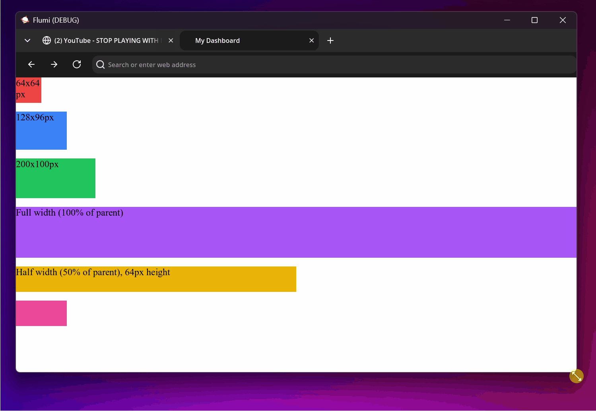

**Common width values:**
- `w-full`: 100% of parent width
- `w-1/2`: 50% of parent width
- `w-1/3`: 33.33% of parent width
- `w-1/4`: 25% of parent width
- `w-auto`: Natural width based on content

### Spacing System Explained
- **Padding** adds space inside an element (between border and content)
- **Margin** adds space outside an element (between border and other elements)

```html
<!-- Padding (internal spacing) -->
<div style="p-4 bg-gray-200">Padding all sides (16px) - Space inside the gray area</div>
<div style="px-6 py-2 bg-gray-300">Horizontal 24px, vertical 8px - Different spacing for x/y axes</div>
<div style="pt-4 pr-3 pb-2 pl-1 bg-gray-400">Individual sides: top-16px, right-12px, bottom-8px, left-4px</div>

<!-- Margin (external spacing) -->
<div style="m-4 bg-red-200">Margin all sides (16px) - Space around the red area</div>
<div style="mt-6 mb-4 bg-green-200">Top 24px, bottom 16px margin - Vertical spacing only</div>

<!-- Custom spacing using exact pixel values -->
<div style="p-[20px] m-[10px] bg-yellow-200">Custom 20px padding, 10px margin</div>
```
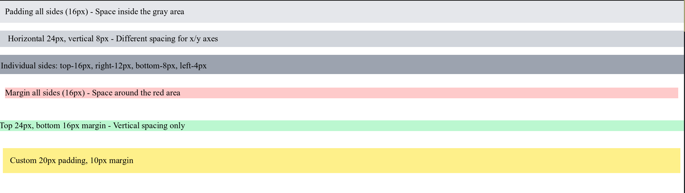

**Spacing direction shortcuts:**
- `p` = padding all sides
- `px` = padding left and right (x-axis)
- `py` = padding top and bottom (y-axis)  
- `pt` = padding top only
- `pr` = padding right only
- `pb` = padding bottom only
- `pl` = padding left only
- Same pattern applies to margins with `m` prefix

## Flexbox System

Flexbox is a layout system that arranges elements in flexible containers. Think of it as a smart way to organize items in rows or columns with automatic spacing and alignment.

Flumi implements browser-grade CSS Flexbox support through [Yoga layout engine](https://yogalayout.com/)

### Container Properties
First, create a flex container to enable flexible layout:

```html
<div style="flex">Basic flex container - Arranges children in a row by default</div>
<div style="inline-flex">Inline flex container - Acts like inline element but with flex children</div>
```

### Direction & Wrap
Control how items flow within the container:

```html
<!-- Direction controls the main axis (primary direction) -->
<div style="flex flex-row">Horizontal layout (default) - Items arranged left to right</div>
<div style="flex flex-row-reverse">Reverse horizontal - Items arranged right to left</div>
<div style="flex flex-col">Vertical layout - Items arranged top to bottom</div>
<div style="flex flex-col-reverse">Reverse vertical - Items arranged bottom to top</div>

<!-- Wrapping controls what happens when items don't fit -->
<div style="flex flex-wrap">Allow wrapping - Items move to next line when container is full</div>
<div style="flex flex-nowrap">No wrapping (default) - Items shrink to fit on one line</div>
<div style="flex flex-wrap-reverse">Reverse wrap - New lines appear above/before previous lines</div>
```

### Alignment System Explained
Flexbox has two axes:
- **Main axis**: The primary direction (horizontal for row, vertical for column)
- **Cross axis**: The perpendicular direction (vertical for row, horizontal for column)

**Justify (main axis alignment):**
```html
<div style="flex justify-start">Start alignment - Items packed at the beginning (default)</div>
<div style="flex justify-end">End alignment - Items packed at the end</div>
<div style="flex justify-center">Center alignment - Items packed in the center</div>
<div style="flex justify-between">Space between - First item at start, last at end, equal space between</div>
<div style="flex justify-around">Space around - Equal space around each item</div>
<div style="flex justify-evenly">Even space - Perfectly equal space between all items</div>
```

**Align (cross axis alignment):**
```html
<div style="flex items-start">Start cross-axis - Items aligned to start of cross axis</div>
<div style="flex items-end">End cross-axis - Items aligned to end of cross axis</div>
<div style="flex items-center">Center cross-axis - Items centered on cross axis</div>
<div style="flex items-baseline">Baseline alignment - Items aligned by their text baseline</div>
<div style="flex items-stretch">Stretch items (default) - Items stretch to fill cross axis</div>
```

### Gap & Spacing
Control spacing between flex items without using margins:

```html
<div style="flex gap-2">8px gap between items - Consistent spacing (2 × 4px = 8px)</div>
<div style="flex gap-4">16px gap between items - Larger spacing (4 × 4px = 16px)</div>
<div style="flex gap-[12px]">Custom 12px gap - Exact pixel spacing</div>

<!-- Directional gaps for precise control -->
<div style="flex flex-col row-gap-2 col-gap-4">Row gap 8px, column gap 16px - Different spacing for each direction</div>
```

### Item Properties
Control individual flex item behavior within containers:

```html
<div style="flex">
    <div style="flex-grow-1">Grows to fill space - Takes available space (factor of 1)</div>
    <div style="flex-grow-2">Grows twice as much - Takes twice as much space as flex-grow-1</div>
    <div style="flex-shrink-0">Never shrinks - Maintains minimum size even when space is tight</div>
</div>

<div style="flex">
    <div style="basis-32">Fixed 128px basis - Preferred size before growing/shrinking</div>
    <div style="basis-[200px]">Custom 200px basis - Exact preferred size</div>
</div>

<!-- Self alignment overrides container's items-* setting -->
<div style="flex h-24">
    <div style="self-start">Align to start - This item ignores container alignment</div>
    <div style="self-center">Align to center - This item centers itself</div>
    <div style="self-end">Align to end - This item aligns to end</div>
    <div style="self-stretch">Stretch to fill - This item stretches regardless of container setting</div>
</div>

<!-- Display order changes visual order without changing HTML -->
<div style="flex">
    <div style="order-3">Third in visual order - Appears last despite being first in HTML</div>
    <div style="order-1">First in visual order - Appears first despite being second in HTML</div>
    <div style="order-2">Second in visual order - Appears middle despite being last in HTML</div>
</div>
```

**Flex grow/shrink explained:**
- `flex-grow-0`: Don't grow (default)
- `flex-grow-1`: Grow to fill space equally with other grow-1 items
- `flex-grow-2`: Grow twice as much as grow-1 items
- `flex-shrink-0`: Don't shrink below basis size
- `flex-shrink-1`: Can shrink when space is limited (default)

## Borders & Effects

### Border Radius Explained
Border radius creates rounded corners. The value represents the radius of the circle used to round the corner:

```html
<!-- Preset sizes with pixel equivalents -->
<div style="rounded bg-gray-300 p-4">Default 4px radius - Slightly rounded corners</div>
<div style="rounded-sm bg-gray-300 p-4">Small 2px radius - Barely noticeable rounding</div>
<div style="rounded-md bg-gray-300 p-4">Medium 6px radius - Moderate rounding</div>
<div style="rounded-lg bg-gray-300 p-4">Large 8px radius - Noticeably rounded</div>
<div style="rounded-xl bg-gray-300 p-4">Extra large 12px radius - Very rounded corners</div>
<div style="rounded-2xl bg-gray-300 p-4">2XL 16px radius - Heavily rounded</div>
<div style="rounded-3xl bg-gray-300 p-4">3XL 24px radius - Extremely rounded</div>
<div style="rounded-full bg-gray-300 p-4">Fully rounded (pill shape) - Perfect circles/ovals</div>

<!-- Custom radius values -->
<div style="rounded-[20px] bg-gray-300 p-4">Custom 20px radius - Exact pixel control</div>
<div style="rounded-[50%] bg-gray-300 p-4">50% radius - Creates circle if element is square</div>
```

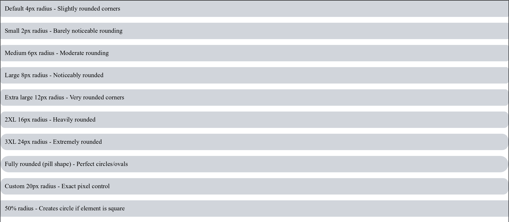

### Border System
Borders create visible lines around elements. You control thickness, style, and color:

```html
<!-- Border thickness (width) -->
<div style="border p-2">Default 1px solid border - Thin line around element</div>
<div style="border-2 p-2">2px border - Slightly thicker line</div>
<div style="border-4 p-2">4px border - Thick line (4 × 1px = 4px)</div>
<div style="border-[6px] p-2">Custom 6px border - Very thick custom line</div>

<!-- Border on specific sides only -->
<div style="border-t p-2">Top border only - Line across the top</div>
<div style="border-r p-2">Right border only - Line down the right side</div>
<div style="border-b p-2">Bottom border only - Line across the bottom</div>
<div style="border-l p-2">Left border only - Line down the left side</div>

<!-- Combined sides with different thicknesses -->
<div style="border-t-2 border-b-4 p-2">Different top/bottom borders - 2px top, 4px bottom</div>
<div style="border-l-6 border-green-500 p-2">Thick left green border - 6px left border in green</div>

<!-- Border styles (appearance) -->
<div style="border border-solid p-2">Solid border (default) - Continuous line</div>
<div style="border-none p-2">No border - Removes any existing border</div>

<!-- Border colors -->
<div style="border-2 border-red-500 p-2">Red border - Colored border using palette</div>
<div style="border-2 border-[#3b82f6] p-2">Custom blue border - Exact hex color</div>
<div style="border border-transparent p-2">Transparent border - Invisible but takes up space</div>
```

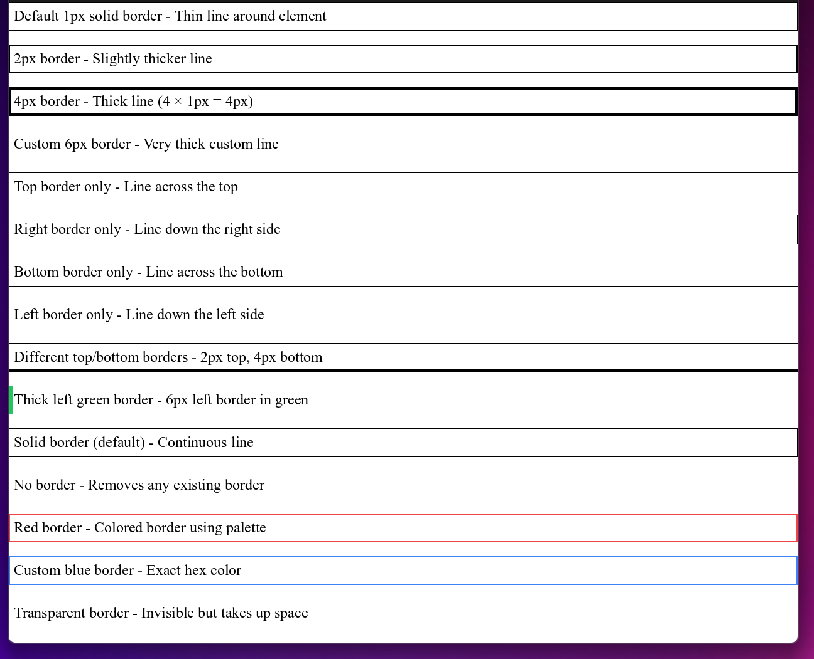

## Interactive States

### Hover States Explained
Hover states trigger when a user moves their mouse cursor over an element. Use them to provide visual feedback:

```html
<button style="bg-blue-500 text-white px-4 py-2 hover:bg-blue-600 hover:text-gray-100">
    Hover to change color - Background darkens, text becomes lighter gray
</button>

<div style="bg-gray-200 p-4 rounded hover:bg-gray-300">
    Hoverable container - Changes background on mouse over
</div>

<!-- Complex hover effects with multiple property changes -->
<button style="bg-[#3498db] text-white rounded-lg hover:bg-[#2980b9] hover:text-[#f8f9fa]">
    Multi-property hover - Changes background and text color
</button>
```

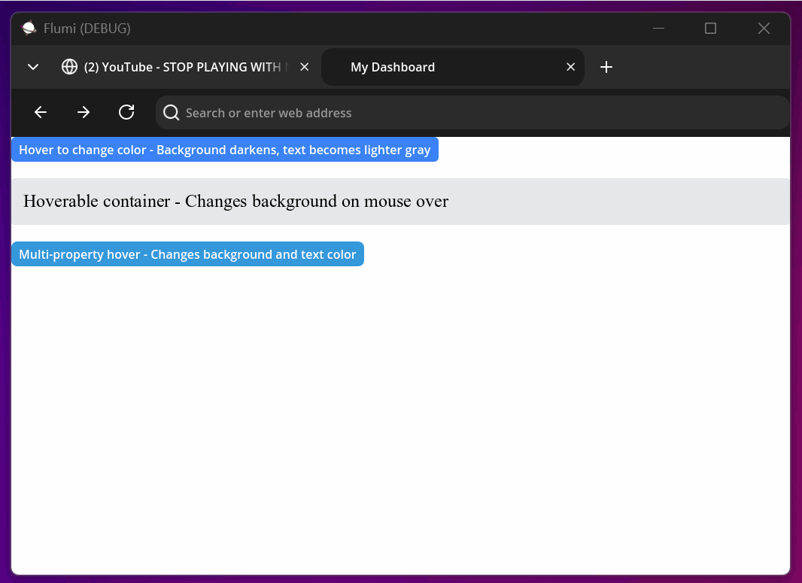

### Active States Explained
Active states trigger when an element is pressed/clicked and held. They provide immediate feedback for user interaction:

```html
<button style="bg-green-500 text-white px-4 py-2 rounded
               hover:bg-green-600 
               active:bg-green-700 active:text-gray-100">
    Click and hold to see active state - Darkest when pressed down
</button>

<!-- Combined states create smooth interaction flow -->
<button style="bg-[#e74c3c] text-white px-4 py-2 rounded
               hover:bg-[#c0392b] hover:text-[#ffffff]
               active:bg-[#a93226] active:text-[#ecf0f1]">
    Hover and active states - Normal → Darker on hover → Darkest when pressed
</button>
```

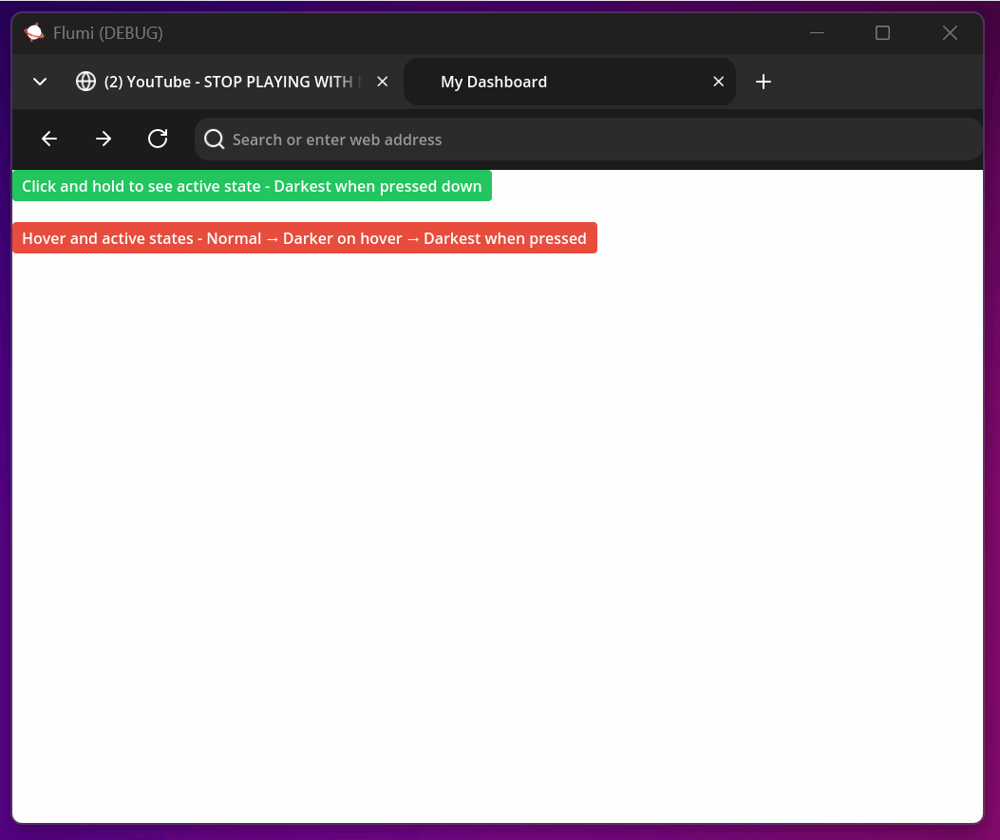

### Cursor Control
Control what mouse cursor appears when hovering over elements:

```html
<div style="cursor-pointer p-4 bg-blue-100">pointer</div>
<div style="cursor-text p-4 bg-green-100">text</div>
<div style="cursor-default p-4 bg-yellow-100">default</div>
<div style="cursor-move p-4 bg-red-100">move</div>
<div style="cursor-crosshair p-4 bg-purple-100">crosshair</div>
<div style="cursor-help p-4 bg-pink-100">help</div>
<div style="cursor-not-allowed p-4 bg-gray-100">not-allowed</div>

<!-- Cursor inheritance flows down to child elements -->
<div style="cursor-pointer bg-gray-200 p-4">
    <p>Parent has pointer cursor</p>
    <p>Children inherit the cursor style automatically</p>
    <div style="bg-gray-300 p-2">
        <p>Nested elements also inherit the same cursor</p>
    </div>
</div>
```
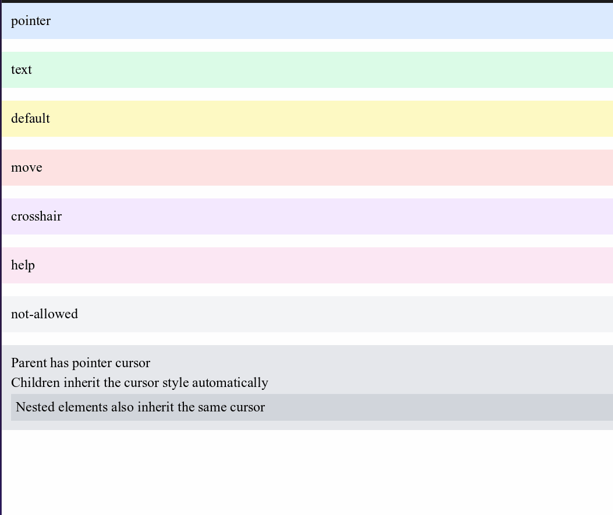

## Advanced CSS Features

### Opacity & Z-Index
- **Opacity** controls transparency (0 = invisible, 1 = fully visible)
- **Z-index** controls stacking order (higher numbers appear in front)
  - Think of it as layers of paper: higher z-index means the paper is on top of others

```html
<div style="opacity-75 bg-red-500 text-white p-4">75% opacity - 25% transparent</div>
<div style="opacity-50 bg-blue-500 text-white p-4">50% opacity - Half transparent</div>
<div style="opacity-[0.25] bg-green-500 text-white p-4">25% custom opacity - Mostly transparent</div>

<!-- Z-index stacking (only works with stacking elements) -->
<div style="z-10 bg-red-500 p-4">Z-index 10 - Middle layer</div>
<div style="z-20 bg-blue-500 p-4">Z-index 20 (on top) - Highest layer, appears in front</div>
<div style="z-[999] bg-green-500 p-4">Custom z-index 999 - Very high layer</div>
</div>
```
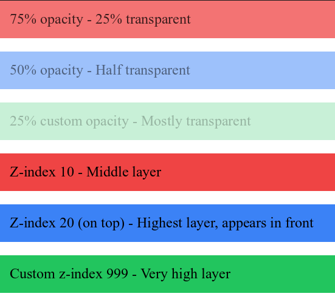

### CSS Selectors
Advanced selector support for complex styling based on element relationships:

```html
<head>
    <style>
        /* Descendant selectors - Apply to nested elements */
        div p { text-[#663399] }  /* All paragraphs inside any div */
        .container span { bg-[#ffeeaa] }  /* All spans inside elements with 'container' class */
        
        /* Direct child selectors - Apply only to immediate children */
        .outer > p { font-bold }  /* Only paragraphs directly inside .outer */
        .parent > button { bg-[#44cc88] }  /* Only buttons directly inside .parent */
        
        /* Adjacent sibling selectors - Apply to next sibling */
        h1 + p { text-[#ff0000] font-bold }  /* Paragraph immediately after h1 */
        h2 + div { bg-[#eeffee] }  /* Div immediately after h2 */
        
        /* General sibling selectors - Apply to all following siblings */
        h1 ~ p { text-[#0000ff] }  /* All paragraphs after h1 (same parent) */
        h3 ~ span { bg-[#ffdddd] }  /* All spans after h3 (same parent) */
        
        /* Attribute selectors - Apply based on HTML attributes */
        input[type="text"] { border bg-[#f9f9f9] }  /* Text inputs only */
        a[href^="https"] { text-[#008000] font-bold }  /* Links starting with https */
        button[disabled] { bg-[#888888] text-[#cccccc] }  /* Disabled buttons */
        input[placeholder*="email"] { border-2 border-[#0066cc] }  /* Inputs with 'email' in placeholder */
        div[style$="special"] { bg-[#ffffaa] }  /* Divs with style ending in 'special' */
        
        /* Pseudo-class selectors - Apply based on element state */
        button:hover { bg-[#2563eb] }  /* Buttons when hovered */
        input:focus { border-blue-500 }  /* Inputs when focused/selected */
        li:first-child { font-bold }  /* First list item */
        li:last-child { text-red-500 }  /* Last list item */
    </style>
</head>
```

### Class-Based Styling
Define reusable style classes for consistent design:

```html
<head>
    <style>
        .card { bg-[#1e293b] text-white rounded-xl p-4 shadow-lg }
        .btn-primary { bg-[#3b82f6] text-white px-4 py-2 rounded hover:bg-[#2563eb] }
        .btn-success { bg-[#10b981] text-white px-4 py-2 rounded hover:bg-[#059669] }
    </style>
</head>

<body>
    <div class="card">
        <h2>Card Title</h2>
        <p>Card content</p>
        <button style="btn-primary">Primary Action</button>
        <button style="btn-success z-10">Success Action</button>
    </div>
</body>
```
:::note
Classes are defined inside `style` attribute alongside inline styles, unlike traditional CSS where they are defined in a separate `class` attribute.
:::

## Default Styles

Gurted provides sensible default styling for all HTML elements so they look good without any custom CSS:

```css
/* Text elements with their default sizes */
body { text-base text-[#000000] text-left }  /* 16px black left-aligned text */
h1 { text-5xl font-bold }  /* 48px bold heading */
h2 { text-4xl font-bold }  /* 36px bold heading */
h3 { text-3xl font-bold }  /* 30px bold heading */
h4 { text-2xl font-bold }  /* 24px bold heading */
h5 { text-xl font-bold }   /* 20px bold heading */
h6 { text-base font-bold } /* 16px bold heading */

/* Text formatting elements */
b { font-bold }      /* Bold text */
i { font-italic }    /* Italic text */
u { underline }      /* Underlined text */
small { text-sm }    /* Small text (14px) */
mark { bg-[#FFFF00] }  /* Highlighted text with yellow background */
code { text-base font-mono }  /* Code text in monospace font */
pre { text-base font-mono }   /* Preformatted text in monospace */

/* Interactive elements */
a { text-[#1a0dab] }  /* Links in traditional blue color */

/* Button styling */
button { bg-[#1b1b1b] rounded-md text-white hover:bg-[#2a2a2a] active:bg-[#101010] }
button[disabled] { bg-[#666666] text-[#999999] cursor-not-allowed }
```

## Complete Examples

### Button Variations
```html
<!-- Basic styled buttons with different colors and shapes -->
<button style="bg-[#4CAF50] rounded-lg text-white px-4 py-2">Green Button - 16px horizontal padding, 8px vertical</button>
<button style="bg-[#2196F3] rounded-xl text-white px-4 py-2">Blue Button - More rounded corners (12px radius)</button>
<button style="bg-[#FF5722] rounded-full text-white px-6 py-2">Orange Pill - Fully rounded with extra horizontal padding</button>

<!-- Multi-state buttons that change on interaction -->
<button style="bg-[#e74c3c] text-white rounded hover:bg-[#c0392b] active:bg-[#a93226]">
    Red Multi-State - Gets progressively darker on hover and click
</button>

<!-- Complex hover effects with dramatic changes -->
<button style="bg-[#34495e] text-[#ecf0f1] rounded 
               hover:bg-[#e74c3c] hover:text-white">
    Dark to Red Transform - Complete color change on hover
</button>
```

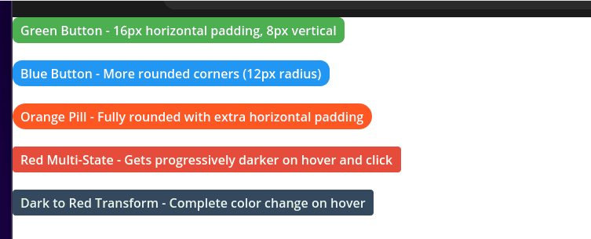

### Dashboard Grid with Responsive Layout
```html
<div style="flex flex-wrap gap-4 p-4">
    <!-- Revenue cards that wrap on smaller screens -->
    <div style="flex-1 min-w-64 text-white p-6 rounded-lg">
        <h3 style="text-xl font-semibold mb-2">Total Users</h3>
        <p style="text-3xl font-bold">1,247</p>
    </div>
    
    <div style="flex-1 min-w-64 bg-gradient-to-r from-green-500 to-teal-600 
               text-white p-6 rounded-lg">
        <h3 style="text-xl font-semibold mb-2">Revenue</h3>
        <p style="text-3xl font-bold">$12,847</p>
    </div>
    
    <div style="flex-1 min-w-64 bg-gradient-to-r from-yellow-500 to-orange-600 
               text-white p-6 rounded-lg">
        <h3 style="text-xl font-semibold mb-2">Orders</h3>
        <p style="text-3xl font-bold">356</p>
    </div>
</div>
```


The CSS system in Gurted provides powerful styling capabilities while maintaining the familiar utility-first approach, all rendered with native performance through the Godot engine.
