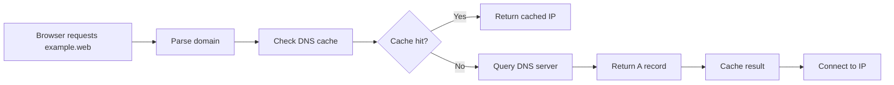
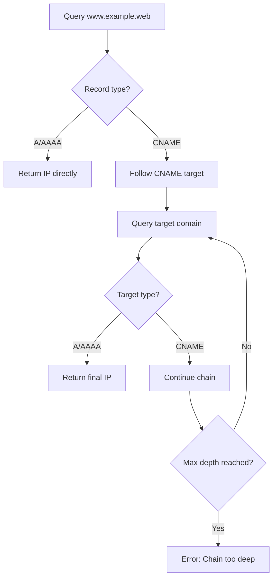

# DNS System

The Gurted ecosystem features a custom DNS system that enables domain resolution for the gurt:// protocol. Unlike traditional DNS, Gurted DNS is designed specifically for the decentralized web ecosystem, providing:

- Domain registration with approval workflows
- DNS record management (A, AAAA, CNAME, TXT, NS)
- Subdomain support with delegation
- CNAME chain resolution
- Nameserver delegation with glue records

DNS queries in Gurted are transmitted using the GURT protocol, which, similar to DNS over HTTPS (DoH), encrypts DNS resolution under TLS. This ensures that your DNS requests are private and secure, making it impossible for your internet provider to see which sites you visit unless they map the IP.

## Record Types

### A Records
- **Purpose**: Map domain names to IPv4 addresses
- **Format**: `example.web → 192.168.1.1`

### AAAA Records
- **Purpose**: Map domain names to IPv6 addresses  
- **Format**: `example.web → 2001:db8::1`

### CNAME Records
- **Purpose**: Create aliases that point to other domain names
- **Format**: `www.example.web → example.web`
- **Chain Resolution**: Supports up to 5 levels of CNAME chaining

### TXT Records
- **Purpose**: Store arbitrary text data
- **Format**: `example.web → "v=spf1 include:_spf.example.web ~all"`

### NS Records
- **Purpose**: Delegate subdomains to other nameservers
- **Format**: `subdomain.example.web → ns1.provider.web`
- **Glue Records**: Automatically handled for in-zone nameservers

## DNS Resolution Flow

### 1. Basic Domain Resolution

Flumi follows a straightforward resolution process for domains like `example.web`:



### 2. Subdomain Resolution

For queries like `api.blog.example.web`:

1. **Exact Match Check**: Look for specific records for `api.blog.example.web`
2. **Parent Domain Check**: If not found, check parent domains (`blog.example.web`, then `example.web`)
3. **Delegation Check**: Look for NS records that might delegate the subdomain

### 3. CNAME Chain Resolution



### 4. NS Delegation

When a domain has NS records:

1. **Delegation Response**: Return NS records and any glue records
2. **Glue Records**: Include A/AAAA records for nameservers within the same zone
3. **Client Resolution**: Client queries the delegated nameservers directly

## API Endpoints

### Domain Management

- `POST /domain` - Register a new domain
- `GET /domain/{name}.{tld}` - Get domain details
- `DELETE /domain/{name}/{tld}` - Delete domain

### DNS Records

- `GET /domain/{name}.{tld}/records` - List all records for domain
- `POST /domain/{name}.{tld}/records` - Create new DNS record
- `DELETE /domain/{name}.{tld}/records/{id}` - Delete DNS record

### DNS Resolution

- `POST /resolve` - Legacy resolution for simple domains
- `POST /resolve-full` - Advanced resolution with subdomain support

#### Request

```json
{
  "domain": "api.blog.example.web",
  "record_type": "A" // optional filter
}
```

#### Response

```json
{
  "name": "api.blog.example.web",
  "tld": "web", 
  "records": [
    {
      "id": 123,
      "type": "A",
      "name": "api.blog",
      "value": "192.168.1.100",
      "ttl": 3600,
      "priority": null
    }
  ]
}
```

## Error Handling

### DNS Resolution Errors

- `ERR_NAME_NOT_RESOLVED` - Domain not found or not approved
- `ERR_CONNECTION_TIMED_OUT` - DNS server timeout
- `ERR_CONNECTION_REFUSED` - Cannot connect to target server
- `ERR_INVALID_URL` - Malformed domain name

### CNAME Specific Errors

- `CNAME chain too deep` - More than 5 CNAME redirections
- `CNAME chain ended without A record` - Chain leads to non-resolvable target
- `Failed to resolve CNAME target` - Intermediate domain resolution failure

### NS Delegation Errors

- `Domain is delegated to nameservers` - Cannot resolve directly, requires external resolution
- `Only IPv6 (AAAA) records found` - IPv4 required for GURT protocol

## Tutorial: Setting Up NS Record Delegation

This tutorial walks you through setting up nameserver delegation for your domain, allowing you to delegate subdomains to external DNS providers or your own nameservers.

### Step 1: Planning Your Delegation

Before setting up NS records, decide:

- **Subdomain to delegate**: e.g., `blog.example.web`
- **Target nameservers**: e.g., `ns1.blogprovider.web`, `ns2.blogprovider.web`
- **Whether you need glue records**: Required if nameservers are within your domain

### Step 2: Creating NS Records

#### Option A: Through Web Interface

1. **Access dns.web**
   - Navigate to `gurt://dns.web`
   - Select the domain you want to configure (e.g., `example.web`)

2. **Add NS Record**
   - Select "NS" from the record type dropdown
   - Enter the subdomain name: `blog` (for `blog.example.web`)
   - Enter the nameserver: `ns1.blogprovider.com`
   - Click "Add Record"

3. **Add Additional Nameservers**
   - Repeat for each nameserver (typically 2-4 nameservers)
   - Use the same subdomain name but different nameserver values

### Step 3: Setting Up Glue Records (optional)

Glue records are required when your nameserver hostnames are within the domain you're delegating.

**Example**: If you want to delegate `blog.example.web` to `ns1.blog.example.web`:

1. **Create the NS Record**
  `NS`, "blog" -> `ns1.blog.example.web`

2. **Create the Glue Record**
  `A`, "ns1.blog" -> `203.0.113.10`

Without the glue record, there would be a circular dependency: to find the IP of `ns1.blog.example.web`, you'd need to query the nameservers for `blog.example.web`, but those nameservers are hosted at `ns1.blog.example.web`.

### Step 4: Configuring the Target Gurted DNS

If you're delegating to another Gurted DNS instance, the target server needs to be configured to handle your subdomain.

#### Target Server Setup

1. **Register the delegated domain** on the target Gurted DNS server
   - Navigate to the target DNS server (e.g., `gurt://blogprovider.web`)
   - Register `blog.example.web` as a new domain
   - Get it approved by the target server administrators

2. **Add records for the subdomain**
   - Add A records: `blog.example.web → 192.0.2.100`
   - Add subdomains: `www.blog.example.web → 192.0.2.100`
   - Add API endpoints: `api.blog.example.web → 192.0.2.101`

### Step 5: Testing Your Delegation

#### Through Flumi Browser
1. **Test the delegated domain**
   - Navigate to `gurt://blog.example.web` in Flumi
   - Should resolve through the delegated nameservers
   
2. **Test subdomains**
   - Try `gurt://www.blog.example.web`
   - Try `gurt://api.blog.example.web`
   
3. **Check delegation in DNS interface**
   - Go to `gurt://dns.web`
   - Look up `blog.example.web` 
   - Should show NS records pointing to your target nameservers

### Real-World Examples

#### Example 1: Blog Delegation
```
Domain: example.web (managed on dns.web)
Delegation: blog.example.web → blogprovider.web

Setup:
1. On dns.web: Add NS record "blog" → "dns.blogprovider.web"
2. On blogprovider.web: Register and manage "blog.example.web"
3. Test: gurt://blog.example.web should resolve through blogprovider.web
```

#### Example 2: API Service Delegation
```
Domain: company.web (managed on dns.web)  
Delegation: api.company.web → apiservice.web

Setup:
1. On dns.web: Add NS record "api" → "ns.apiservice.web"
2. On apiservice.web: Register "api.company.web" and add A records
3. Test: gurt://api.company.web/v1/users resolves to API server
```
