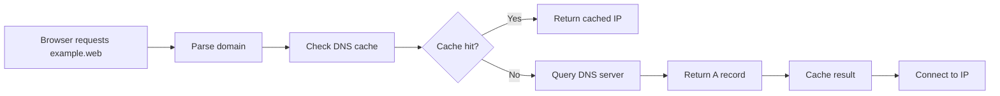
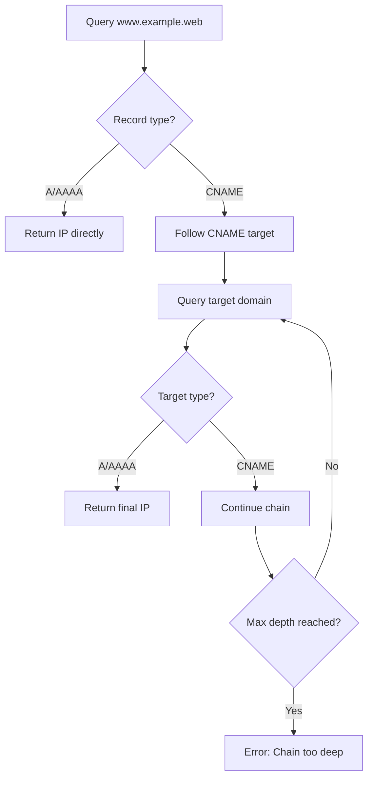

# DNS System

The Gurted ecosystem features a custom DNS system that enables domain resolution for the gurt:// protocol. Unlike traditional DNS, Gurted DNS is designed specifically for the decentralized web ecosystem, providing:

- Domain registration with approval workflows
- DNS record management (A, AAAA, CNAME, TXT)
- Subdomain support with delegation
- CNAME chain resolution
- Nameserver delegation with glue records

DNS queries in Gurted are transmitted using the GURT protocol, which, similar to DNS over HTTPS (DoH), encrypts DNS resolution under TLS. This ensures that your DNS requests are private and secure, making it impossible for your internet provider to see which sites you visit unless they map the IP.

## Record Types

### A Records
- **Purpose**: Map domain names to IPv4 addresses
- **Format**: `example.web → 192.168.1.1`

### AAAA Records
- **Purpose**: Map domain names to IPv6 addresses  
- **Format**: `example.web → 2001:db8::1`

### CNAME Records
- **Purpose**: Create aliases that point to other domain names
- **Format**: `www.example.web → example.web`
- **Chain Resolution**: Supports up to 5 levels of CNAME chaining

### TXT Records
- **Purpose**: Store arbitrary text data
- **Format**: `example.web → "v=spf1 include:_spf.example.web ~all"`

## DNS Resolution Flow

### 1. Basic Domain Resolution

Flumi follows a straightforward resolution process for domains like `example.web`:



### 2. Subdomain Resolution

For queries like `api.blog.example.web`:

1. **Exact Match Check**: Look for specific records for `api.blog.example.web`
2. **Parent Domain Check**: If not found, check parent domains (`blog.example.web`, then `example.web`)

### 3. CNAME Chain Resolution



## API Endpoints

### Domain Management

- `POST /domain` - Register a new domain
- `GET /domain/{name}.{tld}` - Get domain details
- `DELETE /domain/{name}/{tld}` - Delete domain

### DNS Records

- `GET /domain/{name}.{tld}/records` - List all records for domain
- `POST /domain/{name}.{tld}/records` - Create new DNS record
- `DELETE /domain/{name}.{tld}/records/{id}` - Delete DNS record

### DNS Resolution

- `POST /resolve` - Legacy resolution for simple domains
- `POST /resolve-full` - Advanced resolution with subdomain support

#### Request

```json
{
  "domain": "api.blog.example.web",
  "record_type": "A" // optional filter
}
```

#### Response

```json
{
  "name": "api.blog.example.web",
  "tld": "web", 
  "records": [
    {
      "id": 123,
      "type": "A",
      "name": "api.blog",
      "value": "192.168.1.100",
      "ttl": 3600,
      "priority": null
    }
  ]
}
```

## Error Handling

### DNS Resolution Errors

- `ERR_NAME_NOT_RESOLVED` - Domain not found or not approved
- `ERR_CONNECTION_TIMED_OUT` - DNS server timeout
- `ERR_CONNECTION_REFUSED` - Cannot connect to target server
- `ERR_INVALID_URL` - Malformed domain name

### CNAME Specific Errors

- `CNAME chain too deep` - More than 5 CNAME redirections
- `CNAME chain ended without A record` - Chain leads to non-resolvable target
- `Failed to resolve CNAME target` - Intermediate domain resolution failure
