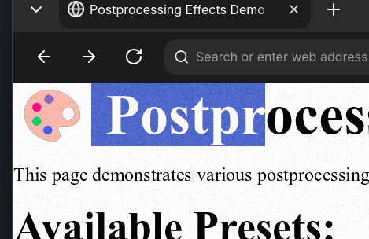
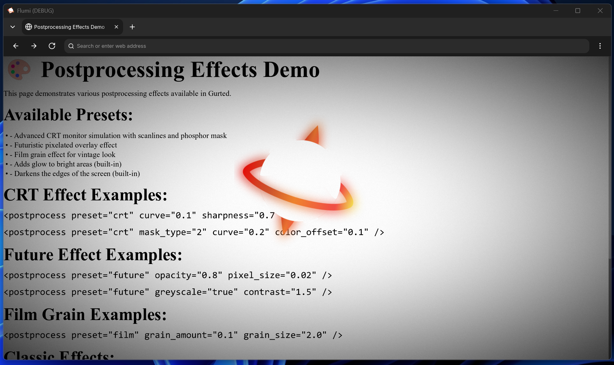
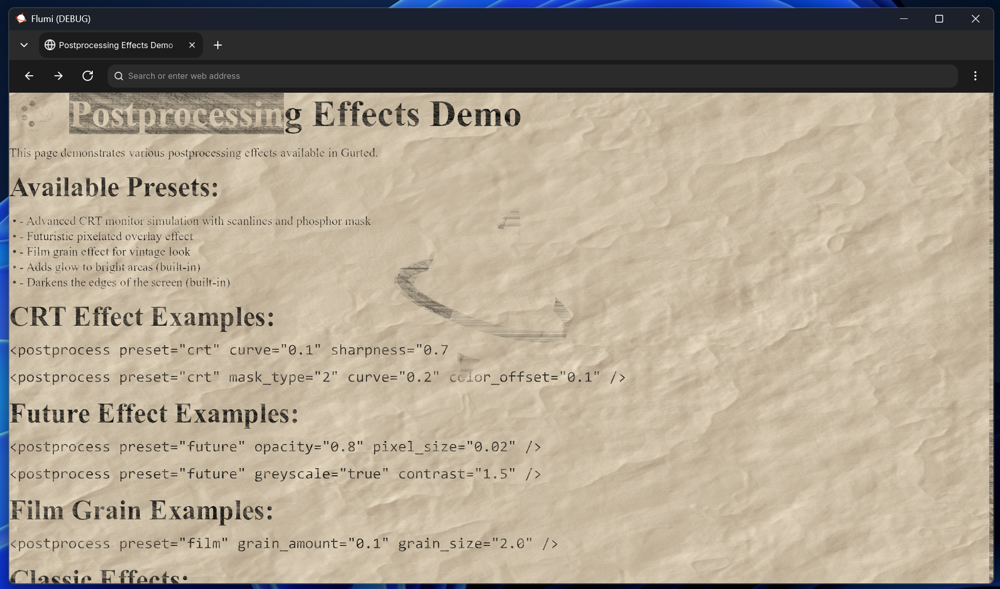
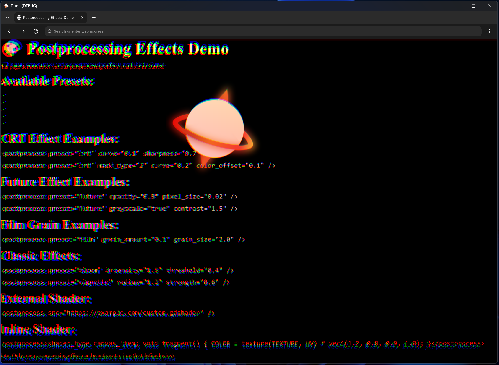
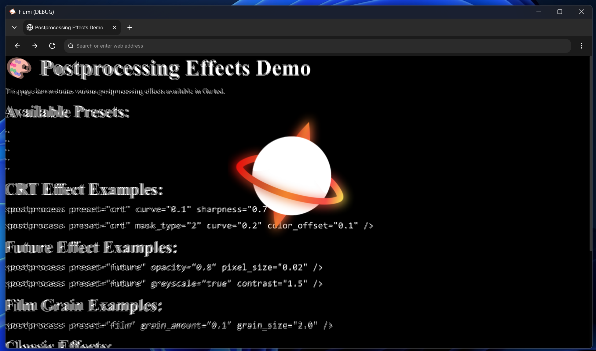
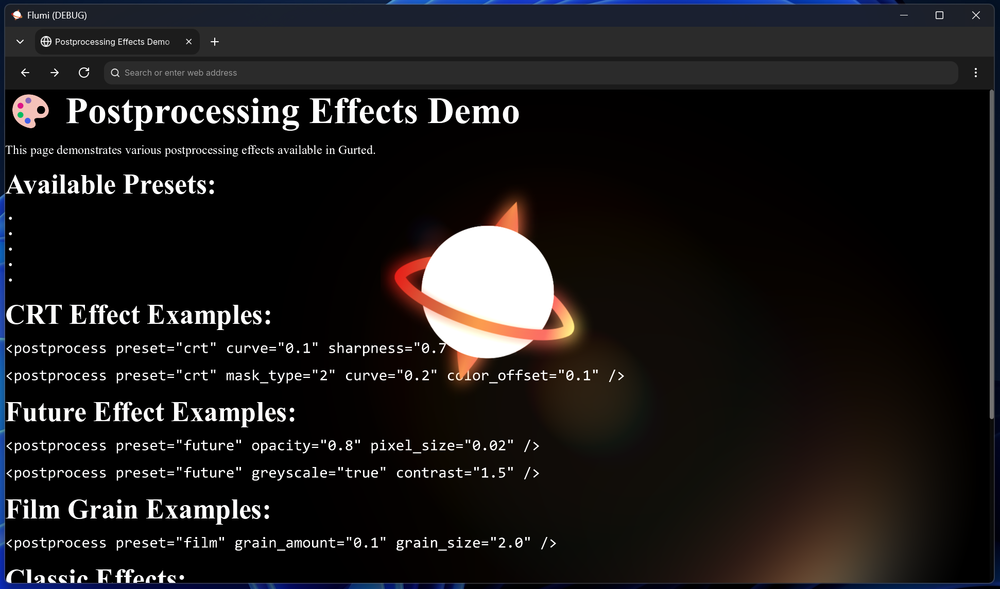
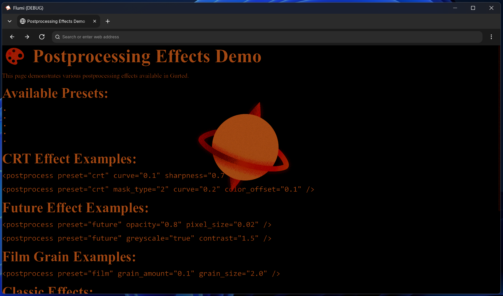

# Postprocess

The `<postprocess>` tag in Gurted allows you to apply real-time visual effects to your entire webpage through GPU-accelerated shaders. These effects are rendered as an overlay on top of your content, not affecting the browser UI.

## Usage

The postprocess tag supports three ways to define shader effects:

```html
<!-- Using built-in presets -->
<postprocess preset="crt" />

<!-- Loading external shader files -->
<postprocess src="custom-shader.gdshader" />

<!-- Inline shader code -->
<postprocess>
shader_type canvas_item;
void fragment() {
    COLOR = texture(SCREEN_TEXTURE, SCREEN_UV);
}
</postprocess>
```

## Shader Tutorial
For documentation on how to write GDShader code, see the [Godot Shader Language documentation](https://docs.godotengine.org/en/stable/tutorials/shading/index.html).

### Parameters

HTML attributes are automatically converted to shader uniforms with the following supported types:

#### Numeric Types
```html
<!-- Float values -->
<postprocess preset="vignette" vignette_strength="1.5"></postprocess>

<!-- Integer values -->
<postprocess preset="snowfall" num_of_layers="25"></postprocess>

<!-- Boolean values -->
<postprocess preset="custom" enable_effect="true"></postprocess>
```

#### Vector Types
```html
<!-- Vector2 -->
<postprocess preset="rblur" blur_center="Vector2(0.3, 0.7)"></postprocess>
<postprocess preset="rblur" blur_center="vec2(0.3, 0.7)"></postprocess>

<!-- Vector3 -->
<postprocess preset="lensflare" tint="Vector3(1.4, 1.2, 1.0)"></postprocess>
<postprocess preset="lensflare" tint="vec3(1.4, 1.2, 1.0)"></postprocess>

<!-- Vector4 -->
<postprocess preset="vignette" vignette_color="Vector4(0.0, 0.0, 0.0, 1.0)"></postprocess>
<postprocess preset="vignette" vignette_color="vec4(0.0, 0.0, 0.0, 1.0)"></postprocess>
```

#### Color Values
```html
<!-- Hex colors -->
<postprocess preset="vignette" vignette_color="#ff0000"></postprocess>

<!-- Named colors work as strings -->
<postprocess preset="snowfall" snow_color="white"></postprocess>
```

## Built-in Preset Shaders

### CRT Monitor Effect
Creates a retro CRT monitor appearance with scanlines, distortion, and screen curvature.

```html
<postprocess preset="crt"></postprocess>
```


**Available Properties:**
- `curvature` (0.0-10.0, default: 2.0) - Screen curvature amount
- `skip` (0.0-1.0, default: 1.0) - Vertical hold distortion intensity
- `image_flicker` (0.0-1.0, default: 1.0) - Image flicker intensity
- `vignette_flicker_speed` (0.0-2.0, default: 1.0) - Vignette animation speed
- `vignette_strength` (0.0-2.0, default: 1.0) - Dark edge vignette intensity
- `small_scanlines_speed` (0.0-10.0, default: 1.0) - Fine scanline animation speed
- `small_scanlines_proximity` (0.01-2.0, default: 1.0) - Fine scanline density
- `small_scanlines_opacity` (0.01-5.0, default: 1.0) - Fine scanline visibility
- `scanlines_opacity` (0.0-2.0, default: 1.0) - Main scanline visibility
- `scanlines_speed` (0.0-5.0, default: 1.0) - Main scanline animation speed
- `scanline_thickness` (0.0-0.6, default: 0.5) - Scanline thickness
- `scanlines_spacing` (0.3-3.0, default: 1.0) - Space between scanlines

### Film Grain Effect
Adds vintage film grain noise to give content an analog film appearance.

```html
<postprocess preset="film"></postprocess>
```



**Available Properties:**
- `grain_amount` (0.0-1.0, default: 0.05) - Amount of grain noise added
- `grain_size` (0.1-10.0, default: 1.0) - Size/scale of individual grain particles

### Vignette Effect
Creates a darkened border around the screen edges, focusing attention on the center.

```html
<postprocess preset="vignette"></postprocess>
```


**Available Properties:**
- `inner_radius` (0.0-1.0, default: 0.1) - Inner edge of the vignette effect
- `outer_radius` (0.0-1.0, default: 1.0) - Outer edge where vignette is strongest
- `vignette_strength` (0.0-2.0, default: 1.0) - Intensity of the darkening effect
- `dither_strength` (0.0-1.0, default: 0.03) - Noise added to prevent banding
- `vignette_color` (color, default: black) - Color of the vignette overlay

### Pencil Effect  
Converts the webpage into a pencil drawing style with adjustable thresholds for line detection.

```html
<postprocess preset="pencil"></postprocess>
```



**Available Properties:**
- `u_bgColorFactor` (0.0-1.0, default: 0.4) - Blend amount of background color
- `u_threshold1` (0.0-1.0, default: 0.75) - Brightest areas threshold
- `u_threshold2` (0.0-1.0, default: 0.50) - Medium-bright areas threshold  
- `u_threshold3` (0.0-1.0, default: 0.25) - Medium-dark areas threshold
- `u_threshold4` (0.0-1.0, default: 0.05) - Darkest areas threshold
- `u_bgTiling` (Vector2, default: vec2(1.0, 1.0)) - Background texture tiling
- `u_patternTiling` (Vector2, default: vec2(1.0, 1.0)) - Pattern texture tiling
- `u_bgColor` (color, default: white) - Background paper color
- `u_patternColor` (color, default: black) - Pencil line color

### Snowfall Effect
Adds animated falling snow particles over the content with customizable layers and physics.

```html
<postprocess preset="snowfall"></postprocess>
```


**Available Properties:**
- `spread` (0.0-1.5, default: 0.5) - Horizontal spread of snowflakes
- `size` (0.01-5.0, default: 0.5) - Size of individual snowflakes
- `snow_color` (color, default: white) - Color of the snow particles
- `snow_transparency` (-0.5-1.0, default: 0.2) - Transparency of snow overlay
- `speed` (0.0-10.0, default: 0.5) - Falling speed of snowflakes
- `wind` (-2.0-2.0, default: 0.0) - Horizontal wind effect
- `num_of_layers` (integer, default: 40) - Number of snow layers for depth

### Chromatic Aberration Effect
Simulates lens distortion by separating RGB color channels, creating a retro video glitch effect.

```html
<postprocess preset="chrome"></postprocess>
```



**Available Properties:**
- `levels` (integer, default: 3) - Number of color separation levels
- `spread` (float, default: 0.01) - Amount of color channel separation


### Radial Blur Effect
Creates motion blur radiating from a center point, useful for speed effects or focus attention.

```html
<postprocess preset="rblur"></postprocess>
```



**Available Properties:**
- `blur_center` (Vector2, default: vec2(0.5, 0.5)) - Center point of the blur effect
- `blur_power` (0.0-1.0, default: 0.01) - Intensity of the blur effect
- `sampling_count` (1-64, default: 2) - Quality of the blur (higher = smoother)

### Lens Flare Effect
Adds realistic lens flare effects, simulating light hitting a camera lens.

```html
<postprocess preset="lensflare"></postprocess>
```


**Available Properties:**
- `sun_position` (Vector2, default: vec2(400.0, 0.0)) - Position of the light source
- `tint` (Vector3, default: vec3(1.4, 1.2, 1.0)) - Color tint of the lens flare

### Foliage Sway Effect
Creates animated wave distortion effects, mimicking vegetation movement or underwater effects.

```html
<postprocess preset="foliage"></postprocess>
```


**Available Properties:**
- `x_intensity` (float, default: 3.0) - Horizontal sway intensity
- `y_intensity` (float, default: 0.5) - Vertical sway intensity
- `offset` (float, default: 0.0) - Animation offset for timing
- `speed` (0-20, default: 2.0) - Animation speed
- `wave_frequency` (0-100, default: 20) - Frequency of wave oscillations
- `wave_length` (50-800, default: 200.0) - Length of wave patterns

### Dithering Effect
Applies retro pixel art dithering with color palette reduction for a vintage gaming aesthetic.

```html
<postprocess preset="dither"></postprocess>
```



:::note
Due to the limitations of GDShader, the dithering effect relies on a `GradientTexture` node internally. This means the colors are hardcoded to be a rusty tint - unchangeable via parameters. A similar effect can be achieved with a custom `<postprocess>` shader without external nodes - however, that's beyond the scope of this preset.
:::

**Available Properties:**
- `pixel` (float, default: 1.0) - Pixel size for the dithering pattern

All postprocess shaders are GPU-accelerated thanks to Godot's shader system.
